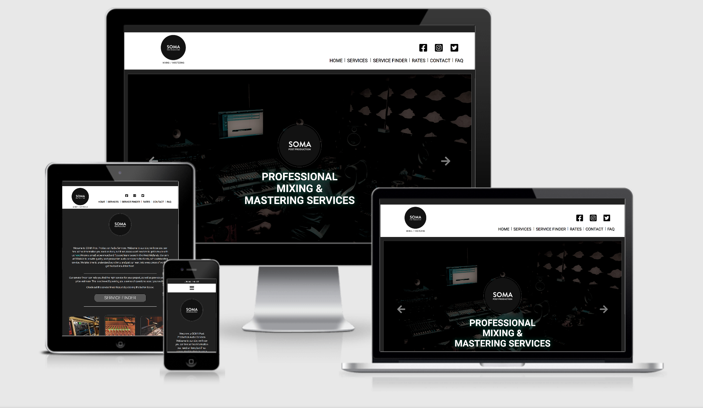

# SOMA Post Production Audio Services
## Code Institute: Milestone Project 2 - Jamie Rolls
---

SOMA Audio Services are a fictional business, who conduct post production audio services within the West Midlands, UK. The business is based on a real world service and is closely linked to my interests and professional qualifications. I have developed a website to showcase the business services to potential clients, using a range of interactive elements and a sharp focus on UX design throughout.

#### **Project Requirements:**
Build an interactive front-end website that responds to user actions and alters the way the site displays data/information.

Required Technologies : HTML - CSS3 - JavaScript
Optional: Include use of JQuery, and other Javascript libraries.

A live version of the site is available [here.](insert link here to live site)

# Table of Contents

1.  [Strategy & Scope](#strategy-and-scope)
    * [UX](#ux)
        * [Business Objectives](#business-objectives)
        * [User Objectives](#user-objectives)
        * [Project goals](#project-goals)
        * [User Stories](#user-stories)
2.  [Structure](#structure)
    * [Design Process](#design-process)
        * [Page Structure](#page-structure)
            * [Home](#home)
            * [Contact](#contact)
            * [FAQ](#faq)
            * [Mastering landing page](#mastering-landing-page)
            * [Mastering & Mixing Services](#mastering-and-mixing-services)
            * [Rates](#rates)
            * [Service Finder](#service-finder)
3.  [Skeleton](#skeleton)
    * [Wireframe Designs](#wireframe-designs)
    * [Responsive Design](#responsive-design)
    * [Changes In Functionality / Design](#changes-in-functionality-and-design)
4.  [Surface](#surface)
    * [Colors](#colours)
    * [Fonts](#fonts)
5.  [Features](#features)
    * [Sitewide](#sitewide)
        * [Modal](#get-a-quote-form)
        * [Navbar](#nav-bar)
        * [Contact Information](#contact-information)
    * [Homepage](#home-page)
        * [Testimonials](#testimonials)
        * [Hero Image Buttons](#hero-image-buttons)
    * [About Page](#about-page)
        * [Google Map Feature](#google-map-feature)
    * [Contact Page](#contact-page)
        * [Contact Us Form](#contact-us-form)
6.  [Future Features](#future-features)
7.  [Technologies Used](#technologies-used)
    * [Languages](#languages)
    * [Libraries](#libraries)
    * [Tools](#tools)
8.  [Testing](#testing)
    * [Testing User Stories](#testing-user-stories)
    * [Testing Features](#testing-features)
    * [Testing Responsiveness](#testing-responsiveness)
    * [Testing Different Browsers](#testing-different-browsers)
    * [Validating Code](#validating-the-html-and-css-code)
    * [Issues Found](#issues-found)
9. [Deployment](#deployment)
    * [Hosting on GitHub Pages](#hosting-on-github-pages)
    * [Cloning](#cloning)
10. [Credits](#credits)
    * [Content](#content)
    * [Media](#media)
        * [Images](#images)
    * [Acknowledgements](#acknowledgements)
        * [Sites used](#sites-used-for-information-and-support)
        * [Advice & Support](#i-received-advice-and-support-from)

# Strategy and Scope
## UX

#### Business Objectives

- The site will contain all information about the services offered by the business, including rates and audio examples of previous work.
- The site should be easy to navigate, have a design which compliments a modern business that aims to make the customer journey a top priority.
- The site will have an interactive 'service-finder'. Which supports the potential client to understand which service could benefit them most. This component of the site will provide a price estimate to its user by asking a series of questions to gather key information and tailor a response accordingly.
- The user should be able to easily contact the business, using a contact form. An automated email response should be sent to confirm receipt of the message.
- The user will be able to join the business mailing list easily from every page. An automated email confirming subscribtion to this will be sent on completion.

#### User Objectives

- Seeking post production services to be completed on a personal / commercial audio project. Comparing services offered to competitors.
- Curious about the services offered, would like to learn more about what is best suited to their projects. Key pages to user: Service Pages, Service-Finder
- Seeking a price estimate for known services. Key pages: Rates Page, Service-Finder.

#### Project Goals

- Create a clear, well designed website for the user to navigate with ease.
- Use a consistent, clear theme throughout the site.
- Consider appropriate pages/layout and content to fulfill business/user objectives.
- Embed interactive elements to the site, which will add real value to both the business and the user experience. Providing user with useful and valid information based on choices.

#### User Stories

1. As a visitor to the site, I want to easily identify the business offer/purpose and be able to easily navigate the site to learn more if desired.
2. As a visitor to the site, I want to learn more about the services offered and listen to some of the work previously completed by the business.
3. As a potential client, I know what service I require and would like to see the business rates.
4. As a potential client, I want to speak to somebody at the company to discuss a more bespoke service.
5. As a potential client, I'm not sure which service would benefit my project the most. I need some support finding the right one.

# Structure

## Design Process

#### Page Structure

* The site is designed to remain simple and stylish throughout, providing users with the information they require / wish to view. To support this design ambition, service pages and the rates page will only display information chosen by the user.

* All pages will adopt a similar page structure with main page content following a page header(if applicable) - the header will detail to the user which page they are currently viewing. This design choice supports the user experience, makes it easier to navigate the site and provides visual feedback to the user.

* Research was conducted to understand how similar businesses present themselves on the internet, this information was used to aid my decisions when deciding the site layout, fonts, colours and general look and feel of the site.

* I began to outline the content requirements for the site and thought about the best way for a user to navigate through this content.

* The following pages were chosen to be created: 
    - Home(index)
    - Contact
    - FAQ 
    - Mastering landing page
    - Mastering Service
    - Stem-Mastering Service
    - Mixing Service
    - Rates
    - Service-Finder

* A top nav bar containing links to a contact page, faq page and 'join mailing list' modal will be present at the top of each page.

* A responsive navbar will embedded within a page header at the top of each page, just below the top navigation links - it will contain links services and rates pages. This navbar will collapse on the smallest screens - and justify centrally on the page between smallest and largest breakpoints.

#### Home

* The Homepage features two areas of content. 

    1. The first section contains a carousel of images related to the business services, with overlaid text highlighting business attributes. 
    
    2. The second section highlights the three main audio services offered by the business - mastering, stem-mastering, mixing.

    Modal: A modal automatically appears after 5 seconds of loading the page. This prompts the user to try out the 'service-finder' feature, it can be closed or the user can choose to follow the link embedded within the modal - to open the service finder in the current tab/window.

#### Contact

* The Contact page will contain a single form, with contact detailed within. The form will capture name, email, subject and a message from the user. Once submitted, the user will recieve an email to the provided email address, this will contain a copy of their message and confirmation their message has been recieved. There will also be a mailto: link, should the user wish to send an email directly to the support team.

#### FAQ

* The FAQ page will display common questions and corresponding answers relating to the business services. The page will have one main section, questions will be displayed in full. To view an answer the user must click/tap the question or '+' icon on the related question. The text element will expand and the icon will change to a '-'. The user may wish to collapse this back to a question only at any point. This results in a much cleaner page design, displaying only the content the user wishes to view.

#### Mastering Landing Page

* This page will simply present the user a choice of two links, displayed in captions, overlaying an image related to an audio service. The links will take the user to either the 'Mastering Service' or 'Stem-Mastering Service' page. This page was created to keep the main site nav-bar simple with only three links. This page acts as a bridge between two similar services, accessible from a single nav-bar link.

#### Mastering and Mixing Services 

* All of the main service pages will contain three sections. The main purpose of these pages is to provide the user with key information about the service offered, as well as price estimates and audio examples of previous work.

    1. Section one will hold the key service information for the user to read and the business to showcase.

    2. Section two will hold a select menu, of service variations. Engaging with this will provide a price estimate to its user, which will update on the page automatically.

    3. Section three will showcase some audio examples of previous work, these will be embedded into the page using the Soundcloud widget. 

#### Rates

* The rates page will contain tables of information, detailing the pricing structure for all main services offered by the business. 
* A clean design will be adopted, displaying only information of interest to its user, based on the users input.
* In total there will be four tables of content. 

    1. Standard Mastering.
    2. Stem-Mastering.
    3. Timed-Mastering.
    4. Mixing.

* On initial visit to the page, no rates table will be displayed. A select menu at the top of the page, will trigger a corresponding table to be displayed below it. Page content will update according to how the user engages with the select menu. 

#### Service Finder

* The service finder page will host an interactive expereience for the site user. Its aim is to provide a bespoke response to each user based on information gathered throughout a series of choices and inputs. 

* The purpose of this is to support potential clients in finding an appropriate service based on their project requirements. It provides automated feedback to potential clients, reducing the need for the direct interaction with the business. 

* This service is always active, therefore it has potential to present financial benefits the business, through suggesting services and engaging customers. As well as providing a support role to users outside of business hours.

* The page content will update, display and hide content based on user input. A flow chart has been developed to explain how the user journey will present itself:

* 

# Skeleton

## Wireframe designs

Wireframes were designed using using Balsamiq, for three primary breakpoints. Desktop, Tablet and Mobile. 

- Desktop Wireframes.

- Tablet Wireframes.

- Mobile Wireframes.

Furthermore theme design was mocked up using Figma. This was completed for the desktop design and the styles/colors will be adopted throughout responsively.

- Home Page / Services.

- Mastering Landing / Rates.

- Service Finder.

Full workspace & diagrams hosted on figma.com can be found here: [Figma.com - Jamie Rolls - MS1](https://www.figma.com/file/YN2IshRoXVvqyn0lXn32kL/MS2?node-id=0%3A1)

## Responsive Design

To ensure the site looked good and operated well on smaller screens, content/layout was reviewed for each breakpoint to ensure user experience remained positive throughout. 

* Top Nav links
    * The contact/faq/join mailing list links will remain visible at all breakpoints. They will centralise below the large breakpoint.
* Nav Bar / banner
    * The navbar / logo banner has three states.
        * The first at large breakpoints and above, all content is visible and aligned left / right of the screen.
        * The second state centralises all content and resizes social icons - this state will be most common for viewing the site on tablet size devices.
        * The third state collapses all links down to a 'burger' icon, removes social icons and justifies the logo left and navbar right - this state will be most common for viewing on mobile size devices.
* Home Page 
    * Image carousel hidden on tablet and mobile due to obtrusive nature and the space taken vs its value on smaller devices.
    * The three services elements use Bootstrap grid. Three column structure each filling 4 parts of the grid at the large breakpoints and above. Otherwise each service occupies full width (12) on tablet and mobile. This makes best use of space on all devices.
* Contact
    * Elements justify centrally on smaller screens to distribute white space more evenly, which looks more pleasing to the eye.
* FAQ
    * Q&A use Bootstrap grid. Two columns each filling 6 parts of the grid at the large breakpoint and above. Otherwise default to 12 each. Serving tablet and mobile displays best.
* Services
    * All elements using the Bootstrap grid take full width below the large breakpoint. Above this elements are split accross the grid evenly to make use of extra space.
* Rates
    * All content remains present throughout each breakpoints. Use of Bootstrap containers maintains good spacing around and between elements. With additional padding and margin added as required to ensure positive viewing experience on all devices.
* Service Finder
    * On larger devices (Bootstrap LG breakpoint and above) The service finder is initially presented with the question surrounded by choices. On small screens this becomes more linear (top to bottom) to maintain a positive user experience. This was achieved using element order attributes alongside media queries and toggling css classes.
    * Image logos for the services had to be manually resized at various breakpoints throughout - down to <300px width

## Changes In Functionality and Design

# Surface

## Colours

A dark theme was chosen for use throughout the site. The colors are dark grey in tone, with the use of white text throughout the site for contrast.

* Color is introduced accross the site with photographs and using hover effects on links.

Colour Palette - Three main colours that compliment the design are:

 -  - `rgb(119, 119, 119)`- Footer & Borders
 -  - `rgb(34, 34, 34)`Dark Background
 -  - `rgb(235, 235, 235)` - Page Headers
 -  - `rgb(96, 125, 139)` - Button Hover
 -  - `rgb(76, 44, 44)` Dark Brown Background 

* Various strengths of opacity are used in combination with the colors above, using the 'rgba' attribute. 

* Coloured shadow is dropped behind the carousel caption text, on the index.html page. Three separate colours are used to blend with the corresponding image. Resulting in a visually please result.

* Other various shades of grey are used to highlight, surround and drop shadows on elements.

<!--
## Fonts

Roboto was chosen as the font to be used site wide, due to its clean professional look. It was imported from 'Google Fonts', I applied the font-family directly to the body, with a fall-back font of sans-serif.

-->

# Features

## Sitewide

### Top Nav Links

* The top nav links remain on all pages thoughout the site. 
    * The contact us, links the user to the contact.html page.
    * FAQ links the user to the faq.html page.
    * Join mailing list - launches a modal where the use can input their email address and click subscribe. Upon completing this action, an automated email will be send to the provided email address, confirming sign up and welcoming the user to the mailing list (acheived using emailjs service). The user can also close the modal if desired, by clicking the 'close' button present in the element.

### Nav Bar

* The site uses Bootstrap to create a collapsed navbar on small devices. This enables users to view more relevant content on smaller screens, with the option to expand the navbar if required.
* The navbar and logo banner become centralized on tablet size devices.
* Links to social media contain a hover effect to indicate a user can interact with the icons.

### Footer

* The site footer has social icons pinned to it, with the same hover effect as the banner/nav section.
* A join mailing list feature is present on the footer. Users can input their email address and click subscribe. Upon completing this action, an automated email will be send to the provided email address, confirming sign up and welcoming the user to the mailing list.

## Index (Home)

### Image Carousel 

* An automated scrolling image carousel is displayed on the home page on the largest screen sizes. This is achieved using supporting code from the Bootstrap carousel component. https://getbootstrap.com/docs/4.0/components/carousel/
* There are also nav buttons, should the site user wish to view the next or previous image as desired.
* The images have overlaid caption text - which has been styled bespokly to the image behind, matching colours and creating a drop shadow.

### Service Finder link & Modal

* Upon visiting the home page, after a duration of 5 seconds a modal appears informing the user of the service finder feature. The user can engage with the modal to goto the service finder page, or close the modal and continue browsing the homepage.
* A link the service finder is available on the home page, situated just above the services information. As a user hovers over this, the link/button highlights to a blue colour to gain attention.

### Services

* The three main services offered by the business each have an element on the homepage. 
* Each contains an image, a short brief and an indication on price. 
* The images and overlaid text link the user the relevant service page if clicked.
* Below the short brief, a call to action button stating "more info", prompts the user. This also links the user to the relevant service page.
* Each button highlights blue, when hovered over.

## Contact Page

### Contact Form

* A user may wish to contact the business. Therefore a general contact form is available on the contact page. 
* All inputs of the contact form have validation rules, so that a user can't submit the form until all fields are filled out correctly. 
* Once a message is submitted, a modal appears to inform the user the message has successfully submitted. The user also receives an email confirming reciept of the message with a copy of the message submitted for reference, this is acheived using the emailjs service.
* The email icon in the contact form, can be clicked. This will open the users default mail client, to compose an email to contact@somapostproduction.com
* All three contact icons have a hover effect, englarging the icons by 10% to gain user attention.

## FAQ Page

* Users can interact with the questions displayed on the screen, to reveal the answers by clicking on the question or the '+' icon.
* To achieve the expand/collapse effect for all questions with a single function, the HTML elements were given corresponding ID's - Jquery was used to capture a question ID attribute and target the related answer using this information. (assets/js/main.js line 83)
* The icon changes to a '-' once the answer is expanded, indicating it will collapse the answer if clicked again. This was acheived with JQuery - toggleClass() feature. The screenreader text also changes from expand to collapse.

## Service Finder

* This page offers its users a fully automated service identifier.
* Content fades in to create a more premium look and feel whilst navigating the questions.
* Information is displayed according to user responses and actions - the logic is coded with JQuery and JavaScript to hide, display and add HTML elements to/from the page. It is also used to toggle CSS classes.
* A reset button is always available to click. This will refresh the page - initialsing the service finder.
* Prices estimates update automatically and can be recalculated without restarting the service finder process.
* Once a user reaches the end of the questions - they are presented with a price estimate and a call to action button which will take the user to the relevant services page.
* A separate js script was created for the service finder - (assets/js/service-helper.js) - this contains all relevant logic relating the service finder utility.
    * HTML is stored in variables at the beginning of the script. This made the code much easier to read and edit if required.

# Future Features

* If this site were for a real business, they may wish to be able to add to, update and edit the FAQ section of the site. Therefore adding this functionality would be beneficial to the functionality of the site.

* Adding a shopping cart utility and giving the user the ability to place orders on the site, would be a natural progression of the site functionality.

* Offering audio uploading functionality directly from the site would be a good idea to improve the customer journey. This could be achieved by embedding a html form which POSTs data to a server.

# Bugs and Fixes to implement

* **Modal Style** - Using iPad (Safari Browser) the modal displays differently, buttons are disproportionate in size.
* **Social Media Icons** - Icons sitewide currently link to their respective social service homepage. These would need to link to corresponding business page.
* **Logo/Banner/Navbar** - Reduce size (height) to take up less space, adjust logo in photo editing software to remove white background. This will allow for styling the banner with a dark theme, in line with the rest of the site.
* **Audio Examples** - Link different audio files from Soundcloud.com accross the various service pages, to showcase the business accordingly.
* **Contact Email** - The contact email address is fictional on the contact page, this address would need to be set up to make the mailto: feature on the contact page functional.

# Technologies Used

## Languages

* HTML - base language used for this project.
* CSS - used for styling HTML code site wide.
* JavaScript - used to make elements of the site interactive and support HTML & CSS styling.

## Libraries

* [Bootstrap](https://getbootstrap.com/) (4.5.2) - with supporting JS Script and tooltips. Used for the responsive grid system, styling elements and navbar creation.
* [FontAwseome](https://fontawesome.com/) (5.15.1) - used for all icons on the site.
* [MD Bootstrap](https://mdbootstrap.com) (4.19.1) - with supporting JS Script - used for modals and contact form.
* [Google Fonts](https://fonts.google.com/) - used for the Roboto fonts.
* [Hover.css](https://ianlunn.github.io/Hover/) - used for animation effects on social icons and various buttons throughout the site.
* [JQuery](https://jquery.com/) (3.5.1) - used throughout the site to target and manipulate HTML elements and also in conjunction with the Bootstrap library.
* [Chosen](https://harvesthq.github.io/chosen/) (1.8.7) - used to replace the standard select menus sitewide

## API

* [Emailjs](https://www.emailjs.com/) - used to send confirmation emails in both the join mailing list and contact form elements.

## Tools

* [Gitpod](https://www.gitpod.io) - used as IDE for this project.
* [Git](https://git-scm.com/) - used for version control.
* [Github](https://github.com/) - used to host repository and live website.
* [Balsamiq](https://balsamiq.com/) - used to develop initial scratch wireframes.
* [Figma](https://www.figma.com/) - used for creation of website theme/wireframe.
* [Am I Responsive](http://ami.responsivedesign.is/) - used for testing purposes and for the screenshot at the top of my README filed to display the web pages on different devices.
* [Google Chrome DevTools](https://developers.google.com/web/tools/chrome-devtools) - used for testing and debugging the site.
* [w3 html validator](https://validator.w3.org/) - used to test and validate my html code.
* [w3 css validator](https://jigsaw.w3.org/) - used to test and validate my css code.
* [jshint](https://jshint.com/) - used to test and validate all js code.
* [ezgif](https://ezgif.com/) - used in testing.md to capture interactive elements into gifs.
* [Diagrams.net](https://app.diagrams.net/) - used to create flowchart diagram for the service finder.
* [hex to rgb converter](https://www.webfx.com/web-design/hex-to-rgb/) - used to get consitency within my code.

# Testing

All testing has been documented [testing.md](https://github.com/jamie120/MS2-Soma-Post-Production-Services/blob/master/testing.md)

# Deployment

* The site was developed in GitPod and pushed to the following remote GitHub repository - [REPO](https://github.com/jamie120/MS2-Soma-Post-Production-Services)
    * The following GIT commands were used throughout deployment:
        * **git status** ------ used to check the status of files and any changes made / untracked.
        * **git add**   ------ to stage files ready to commit.
        * **git commit -m " "**  ------ to commit the files.
        * **git push** ------ to push the files to the master branch of the GitHub repo.

    * NOTE : commit text on this project was written in 'past tense' up until 4th November 2020.
    * All future commits from 4th November date are written in present tense - following action suggested by my mentor.

### Hosting on GitHub Pages

* This site is hosted using GitHub pages, deployed directly from the master branch. - [LIVE SITE](https://jamie120.github.io/MS2-Soma-Post-Production-Services/index.html)
    * The following steps were taken to complete the hosting process.
        1. Log into GitHub.
        2. Choose the relevant repository. [SOMA Post Production Audio Services](https://github.com/jamie120/MS2-Soma-Post-Production-Services).
        3. Go to settings.
        4. Scroll down to GitHub Pages section.
        5. Select as a source **master branch**.
        6. The page is now automatically refreshed and the project is deployed.

    * In order for the site to deploy correctly on GitHub pages, the landing page must be named index.html
    * The deployed site on GitHub pages will update automatically upon new commits to the master branch.

    ##### For more detailed information regarding GitHub Pages deployment click [here](https://pages.github.com/).

### Cloning

To run this code locally, you can clone this repository directly into the editor of your choice by following the steps below:

1. Open Terminal.
2. Change the current working directory to the location when you want the cloned directory.
3. Type the following into your Terminal:  
    git clone https://github.com/jamie120/MS2-Soma-Post-Production-Services.git
4. Press Enter to create a local clone.

* To cut ties with this GitHub repository, type git remote rm origin into the terminal.

##### For more information regarding cloning of a repository click [here](https://help.github.com/en/github/creating-cloning-and-archiving-repositories/cloning-a-repository).

# Credits

## Content

All the content of the website was written by me. 

## Media

All Soundcloud embedded tracks are owned and copyrighted by myself (Jamie Rolls).

### Images

* All images were obtained from unsplash, found via the search term: recording studio.

https://unsplash.com/s/photos/recording-studio

Each images is licenced to use royalty free.

## Acknowledgements
   
### Sites used for information and support

* [W3C](https://www.w3.org/)
* [Stack overflow](https://stackoverflow.com/)
* [W3schools](https://www.w3schools.com/)
* [CSS-Tricks](https://css-tricks.com/)
* [JQuery Documentation](https://api.jquery.com/)
* [mdbootstrap JQuery documentation](https://mdbootstrap.com/docs/b4/jquery/)
* [Bootstrap Documentation](https://getbootstrap.com/docs/4.0/getting-started/introduction/)
* [EmailJS Documentation](https://www.emailjs.com/docs/)

#### I received advice and support from
   * Seun Owonikoko (my mentor)
   * new mentor
   * Code Institute - Slack Community (various students, tutors and mentors)