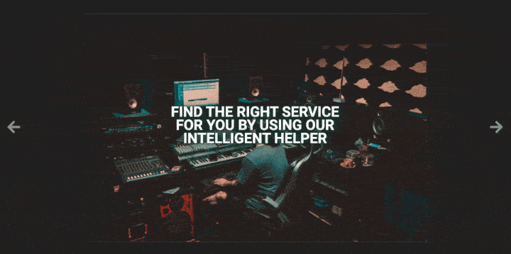
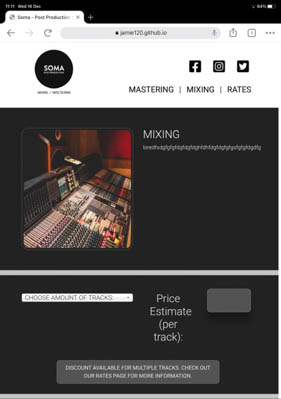
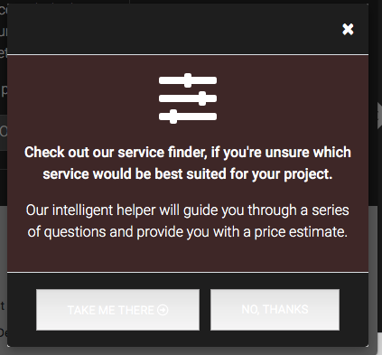

# Testing

[back to README.md](https://github.com/jamie120/MS2-Soma-Post-Production-Services/blob/master/README.md)

## Contents

1. [Manual Testing](#manual-testing)
    * [Home Page](#home-page)
    * [Contact Page](#contact-page)
    * [FAQ Page](#faq-page)
    * [Services Pages](#service-pages)
    * [Rates Page](#rates-page)
    * [Service Finder](#service-finder)
    * [Site Wide](#site-wide)
    * [Fixes required](#fixes-required)
2. [DevTools](#devtools)
3. [Automated Testing](#automated-testing)
    * [Code Validation](#code-validation)
    * [Browser Validation](#browser-validation)
4. [User Stories](#user-stories)
5. [User Testing](#user-testing)
    * [My Mentor](#my-mentor)
    * [Peer-code-review](#peer-code-review)
    * [User review](#user-review)

## Manual Testing

### Testing completed using the following browsers: 

* Google Chrome (Version 87.0.4280.67) using MacOS on a monitor running at 1920 x 1080.
* Safari (Version 11.1.2 (13605.3.8)) using MacOS on a monitor running at 1920 x 1080.
* Apple iPad Pro 11" -  Safari and Google Chrome - latest build at 16/12/2020.
* Apple iPhone X - Safari and Google Chrome - latest build at 16/12/2020.

### **The following checks were completed on all browsers, any issues have been captured and documented below with screenshots.**

### **Home Page**
* Verify the page loads responsively on all device sizes. With desired elements displayed or hidden as required - :white_check_mark:
* Verify the carousel loads and images automatically scroll with corresponding text caption - :white_check_mark:
    
    

* Check all links on index.html take users to the correct pages - :white_check_mark:
* Check Modal opens from index.html after 5 seconds - :white_check_mark:

### **Contact Page**

* Verify email is received upon submitting a message using the contact form - :white_check_mark:
* Verify input field validation is working, to prevent a user submitting the form with empty fields - :white_check_mark:
* Verify that a new tab/mail client opens when the email icon is clicked - :white_check_mark:
* Verify all links on contact.html take users to the correct pages - :white_check_mark:

### **FAQ Page**

* Verify the page loads responsively on all device sizes. With desired elements displayed or hidden as required - :white_check_mark:
* Verify each answer is expandable using the provided icons - :white_check_mark:
* Verify icons change to minus once an answer is expanded and reverts back to plus once collapsed - :white_check_mark:
* Verify all links on faq.html take users to the correct pages - :white_check_mark:

### **Service Pages**

* Verify the page loads responsively on all device sizes. With desired elements displayed or hidden as required - :white_check_mark:
* Verify any images display as desired - :x:
    
    Issue identified on iPad and iPhone, where the service image appears stretched - note to fix added to revisions.

    

* Verify all text is clear and formatted correctly - :x:

    Issue identified on iPhone only - Select menu placeholder is not visible - note to fix added to revisions.

* Verify all JavaScript is working by ensuring prices update for all iterations of the select menu - :white_check_mark:
* Verify all links take users to the correct pages - :white_check_mark:

### **Rates Page**

* Verify the page loads responsively on all device sizes. With desired elements displayed or hidden as required - :white_check_mark:
* Verify all JavaScript is working by ensuring the correct rates table is displayed based on selection in the select menu - :white_check_mark:
* Verify all links take users to the correct pages - :white_check_mark:

### **Service Finder**

* Verify the page loads responsively on all device sizes. With desired elements displayed or hidden as required - :white_check_mark:
* Verify all JavaScript is working correctly by conducting user story tests to reach all possible outcomes:
    * Timed Mastering - :white_check_mark:
    * Stem Mastering - :white_check_mark:
    * Standard Mastering - :white_check_mark:
    * Mixing Service - :white_check_mark:
* Verify all calculations are correct, according to the rates - :white_check_mark:
* Verify calculate button revises to 'recalculate' once clicked - :white_check_mark:
* Verify all links take users to the correct pages - :white_check_mark:
* Verify the reset button works at any point - :white_check_mark:
* Verify a modal appears if the reset button is clicked - :white_check_mark:

### **Site Wide**

* Check navar is collapsed on iPhone -  :white_check_mark:
* Verify email is received upon signing up to the mailing list using the subscribe button on the footer - :white_check_mark:
* Verify email is received upon signing up to the mailing list using the top nav modal link - :white_check_mark:
* Verify social icon links on the footer and navigation banner direct the user to the relevant social service - :white_check_mark:
* Check elements appear on all pages correctly across all browsers - :x:

    In both Safari and Chrome, the service title overlays the text iPhone and in portrait on iPad - note to fix added to revisions.

    
    

    Modal style on Safari MacOS button style not as desired - note to fix in future versions.

    

    

### Fixes required 

Service pages - 
* Issue identified on iPad and iPhone, where the service image appears stretched.
* Issue identified on iPhone only - Select menu placeholder is not visible 

index.html - 
* In both Safari and Chrome, the service title overlays the text. This occurs on both iPad and iPhone.
* Modal button style not as desired on MacOS - Safari Browser

# DevTools

Google DevTools was used inside Google Chrome on MacOS throughout the development process. 

* Testing responsiveness of the site across several device models. 
    * Media queries written accordingly to better support popular devices such as iPad.

* Target elements and style with CSS, to test potential changes prior to coding them into relevant HTML.

* Console used to support development of JavaScript code.
    * console.log used at various points to check values of variables and function outputs, whilst developing logic for site.
    * Upon site completion - the console was checked for any errors
    * Console was used to check the status of Emailjs - to ensure requests were being sent to the server.
    * Once the site was completed, the console was checked for any errors on each page :white_check_mark:

# Automated Testing

## Validating the HTML, CSS and JS code

All of my code passed the following validation tests/services:
- HTML: [W3C Markup Validation Service](https://validator.w3.org/)
- CSS: [W3C Markup Validation Service](https://jigsaw.w3.org/css-validator/)
- JS: [jshint](https://jshint.com/)

Screenshots of validations for each page of code can be found [here](https://github.com/jamie120/MS2-Soma-Post-Production-Services/blob/master/documentation/testing/validation)

* There were various HTML and CSS validation issues to resolve. These mainly referred to formatting my code and were easily fixable across the site.
* JS Validation highlighted the need the service-helper code to be parsed through Babel with the template literal plugin. This enables the code to be compatible with IE 11. 
* Various missing semicolons, unnecessary semicolons and various formatting errors were also highlighted. All have been resolved as required.

# User Stories

#### User Story 1
##### As a visitor to the site, I want to easily identify the business offer/purpose and be able to easily navigate the site to learn more if desired.
* Upon visiting the site, it is clear that the business offers audio services. 
* There is a navbar at the top of the page which clearly directs me to key pages.
* There are also several links at the top of each page, which allows me to reach a contact page, FAQ page and join a mailing list.

#### User Story 2
##### As a visitor to the site, I want to learn more about the services offered and listen to some of the work previously completed by the business.
* The home page indicates to me as a user, there are three main services offered - indicated by three elements at the bottom part of this page - and the main navbar.
* By clicking on one of these elements, I am taken to a main page relating to that selected service. On this page there are several audio examples, which play within the browser. 

#### User Story 3
##### As a potential client, I know what service I require and would like to see the business rates.
* Upon vising the site, I can see one of the main three links in the navbar is 'RATES'.
* On the rates page, I'm not overwhelmed with unnecessary information - the rates page allows me to select only the service I wish to see prices for.

#### User Story 4
##### As a potential client, I want to speak to somebody at the company to discuss a more bespoke service.
* I am able to vising the contact us page to leave a message to request a call-back. 
* I can call the business directly, there is a phone number available on the contact us page.
* Upon visiting the FAQ, this question has a response and encourages me to call.

#### User Story 5
##### As a potential client, I'm not sure which service would benefit my project the most. I need some support finding the right one.
* Whilst browsing the site, I had come across a feature called 'service-finder' I can get to this from the home page(index.html) and each of the services pages.
* A pop-up appeared after a few seconds on the home page (index.html). This appears to take me to an interactive app, the service finder. It was able to identify exactly what service I need.

# User Testing

## My-Mentor

## Peer Code review

## User Testing